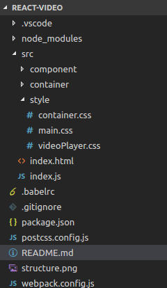

# react-video
#### 安装
1. npm安装 
	下载node，按照步骤安装node，命终端输入`node --version`，检查是否安装成功
2. 依赖下载 
	终端输入`npm install`下载所需依赖

#### 快速开始
* pack-dev-server起http服务 
  终端输入`npm run server`，即可在`npm install`预览页面
* 打包项目 
  终端输入`npm run start`,即可在根目录下生成打包后的项目
	
#### 功能列表	
   常规播放器有的功能都有

#### 项目结构
 

#### tips
1. .vscode 目录是我用的编辑器的配置文件，没什么关系，不用管
2.  node_modules 目录下是项目所需要的依赖包
3.  src目录下是项目源码
